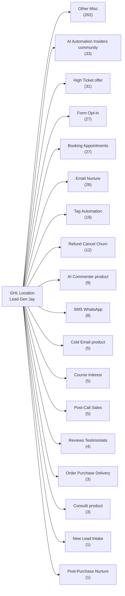

# GoHighLevel Workflows Map

> **Lead Gen Jay · location `YB8rMdFShcHGcZGW87mA`** · pulled live with `ghl --json workflows list` on 2026-05-23.

**481 workflows total** · 286 published · 189 draft

---

## At a glance



---

## Categories

### Other / Misc — 262 workflow(s)

*151 published · 110 draft*

| Name | Status | Last updated | ID |
|------|--------|--------------|----|
| 1 on 1 Meeting | published | 2025-09-24 | `b2265fa3-ebc3-4be7-86cd-2fa3b3504eb7` |
| 1.a Power Dialer | draft | 2026-02-04 | `72cc5a44-1438-4937-8072-13ea58b3d3ab` |
| 14 Days - Unlock Modules (3 Split) | published | 2025-06-26 | `ef0c8284-9be1-467f-8112-1d2aba0047a0` |
| 14 Days - Unlock Modules (Not 3 Split) | published | 2025-09-11 | `64c3dd6e-c919-46e9-9101-34ebb30d527a` |
| 3 Step Cold Template | published | 2025-10-13 | `c102a5a5-f67d-4417-b41c-a8bfe3e037a3` |
| 50K Agency Owners | published | 2026-02-15 | `4fdf89f8-a7d6-4301-8cc2-debb4d2dcda2` |
| [NEW] DND OFF -> Beehiiv Resub Sync | published | 2026-05-20 | `8ebf44e6-1cd7-40df-9af2-a55e8f66c40f` |
| [NEW] DND ON -> Beehiiv Unsub Sync | published | 2026-05-20 | `a7a3c2cc-ff78-47a7-9b54-2d660fa4d5a5` |
| Affiliate Application | published | 2025-10-12 | `f9f24e44-97f6-4091-b40b-462b0825d24f` |
| Affiliate Onboarding Drip - Lead Gen Jay | published | 2026-03-28 | `08ab5558-fde7-4391-b313-32769c35aaf1` |
| Affiliate Test | draft | 2023-08-30 | `a4beab3a-39dc-4b66-9cf9-3bf5b0c862ad` |
| Agreement Pending | published | 2025-10-13 | `aa6ab032-d4c3-4b78-9cf8-064a75f09fd9` |
| AI Message | draft | 2025-04-22 | `08ab820b-6efe-4e4f-be4b-e86c6a882056` |
| AI Responded => Remove from Database Reactivation Pipeline | draft | 2025-11-25 | `12ed1444-50c1-4ff9-8b51-9eadca729b29` |
| AI Sales Call Screening | published | 2025-08-19 | `48189144-dc80-41ff-87ab-7f569b3ddf49` |
| AI Setter Router | published | 2026-05-06 | `a7f10f4b-4150-4b13-9794-23698be94c11` |
| All Leads -> Enrich N8N | published | 2025-12-28 | `76ce5f26-91bd-46a0-b0c4-2ec0ee46b356` |
| All Orders - Connect Customer and Team | published | 2025-05-14 | `54ee30cd-dd9a-4e54-8c3c-8ff52b3c1b99` |
| All Orders ->UTM Tracking + Payment Plan | published | 2025-12-17 | `26a53d5c-e0f4-4746-9b63-f4b937f2b5e1` |
| Beehive Webhook test | draft | 2026-05-16 | `a8cc7007-4f03-408e-9aa5-3a8f054bd8d9` |
| Black Friday Test | published | 2025-10-14 | `dc6bddd1-ac56-4e10-9e2e-30650887f23a` |
| Blacklist Alert | published | 2026-04-12 | `8df25d5e-e685-4815-a622-62bed85a7d6c` |
| BNPL - Elective Denied | published | 2024-07-30 | `32f944f8-9433-4387-8410-115f85d11cf9` |
| BNPL - Pressure (Hold) | draft | 2025-05-11 | `9894c8c3-74c8-4c39-acfb-578ac8836443` |
| BNPL Help | published | 2025-10-13 | `8a8afd80-1e4a-44d9-ac6b-32d29890eafd` |
| Bonus - 1M+ Pre-Scraped List Voucher | published | 2026-05-17 | `b13d88aa-085e-4281-ac7a-f95c62d4544b` |
| Bonus - Early Course Access | published | 2026-05-17 | `bd8eeb71-226b-4bce-a3a1-607417f96794` |
| Bonus - Free coaching | published | 2026-05-17 | `bf3ee219-1c38-468d-ad13-2518a72fcedf` |
| Bonus - Free Implementation | published | 2025-08-30 | `ac595644-406b-406c-8f3e-58a2381bc465` |
| Bonus - GHL 12 Months | published | 2025-08-30 | `1a5556d7-fb4d-4306-8746-51c282a270b0` |
| Bonus - Trusted Leads 25K | published | 2026-03-27 | `92960e1a-823e-45a4-8a59-411bf99fe608` |
| Bonus Coaching Booked - Pay Coach | published | 2026-03-25 | `a700a85b-f251-49e9-b00a-98e34acf0179` |
| Call Booked - Sales -> Create Deal | published | 2026-04-08 | `a608e475-ec48-4ce3-a262-bca996c1dee9` |
| Call Dial Complete | draft | 2025-11-26 | `473d31ee-f811-4075-89bd-4e4c7e98ee03` |
| Call Funnel - Schedule a Call | published | 2026-05-22 | `90609481-29f3-4c0f-a9ef-526870eb2800` |
| Call Scheduled --> Mark Deal "Won" | draft | 2023-12-08 | `6de9a10b-b69f-4a87-85e3-e99fb86ec9d0` |
| Case Study Received - Gift? | draft | 2026-01-30 | `eac117a7-c88f-4bea-b6b5-4febc23cc319` |
| CATCH ALL OLD VERSION | draft | 2026-05-06 | `a52365c3-26af-4d9f-868d-73135a6daaeb` |
| Catch-all - New Contact Router - V2 | published | 2026-05-22 | `8becb8bb-60e8-4585-aa31-f56a28e50313` |
| Check Bank Pending Payment | published | 2025-07-02 | `502c94d2-62d9-4d3c-81cc-5589dc8bebc4` |
| Check Phone for iMessage & Wait for Reply | published | 2026-02-14 | `47727a73-4c0d-460c-939e-228dd4427c61` |
| Check Phone Status by Country | published | 2025-06-06 | `61ecac69-d3b4-4a91-ac47-6cea9fb76e7d` |
| Coaching Application -> Yes/No | published | 2025-09-11 | `304a980e-92f3-427a-b78e-a9503dfdd27e` |
| Coaching Call -> Feedback | published | 2025-10-17 | `d10508e7-1dbd-4f12-9a72-09e2689c66e4` |
| Coaching Call Booked (Bonus) -> Reminders -> Feedback | published | 2025-06-06 | `94a47c0d-4a9b-4adb-98a6-5107577547b5` |
| Coaching Call Booked -> Reminders | published | 2025-10-17 | `f3a63e42-068c-42a8-b985-f567277c1e2d` |
| Coaching Call Paid - Create Manual Affiliate Sale (UPDATE) | published | 2025-12-24 | `c70d844c-6968-4d8a-8105-e0b155054f7c` |
| Coaching Feedback Received | published | 2024-12-30 | `e58766bf-d1d7-4cdc-a377-6a9436eef95e` |
| Coaching Onboarding Booked -> Set Up ->Add to Affiliate | published | 2025-10-03 | `9219f350-ad88-419f-a991-af6f1ca8d3a8` |
| Confirm Sales Referral - Other (Step 2) | published | 2026-02-05 | `002ad7e9-9281-4739-8cdf-7b37d607b037` |
| Contract Template | published | 2025-10-13 | `8e5ffb16-ba05-4844-8a88-67caac6e9af9` |
| Copy - BNPL - Pressure | draft | 2024-08-31 | `43b3eeb6-facf-4dea-b365-ebcef0ec777f` |
| Coupon Redeemed -> Give Bonuses (Labor Day) | published | 2025-08-30 | `fc4f1ccb-245e-4bde-8add-e4fcf288b779` |
| Course Completed | draft | 2024-02-18 | `b06ce015-5ce2-4eb3-88a1-ef755e2afe8c` |
| Course Feedback Survey | published | 2025-10-13 | `ba2afd88-6ace-458d-b8f0-3e3dead5c621` |
| Course Intake -> Send Card (Moved) | draft | 2025-08-21 | `947f6f89-8dd8-44b5-ab0a-422103476006` |
| Course Intake -> Webhook | published | 2025-08-21 | `b06da664-4f1b-4a90-8369-ad85447795c7` |
| Course Started -> Affiliate & Feedback | draft | 2024-02-18 | `fbaca428-a62d-4d32-a19f-476afa01c2e4` |
| Create Course Agreement MANUAL MAKE.COM | published | 2025-05-14 | `ed0d9a69-ccac-44fb-a11e-efd0ef1438ac` |
| Create Stripe Coupon 24 Hr | published | 2025-10-13 | `333aca9d-9199-4673-aed0-2b24825901ec` |
| Custom Project Submission -> Manual Commission | published | 2026-01-30 | `2ec410a4-24f9-45a4-b2d4-46ccc554e75d` |
| Custom Project Terms Signed | published | 2025-11-16 | `17ac4023-e73f-4ab9-9d60-9391af19df66` |
| Custom Prompting | draft | 2025-11-25 | `00804edf-0633-4acb-b647-0c17e3effa3e` |
| Database Reactivation Campaign 1 | draft | 2025-11-25 | `d46d297a-1c83-40fe-8a5f-185e6229bc05` |
| Database Reactivation Timer | draft | 2025-11-25 | `a084e859-2409-4bed-9ed2-3ef98729f435` |
| Deliver 7 Step Template Bump | published | 2024-12-04 | `87e9aa95-f907-401b-a144-1ab72fafe753` |
| Discount Code Activated | draft | 2024-06-18 | `1185198c-d7d9-4c94-a562-cf1f26660db6` |
| Dispute -> Send Agreement & Remove from Workflows | published | 2025-06-24 | `f88137c2-8354-40d7-9212-02a53892d1cb` |
| DM "ENGINE" | published | 2025-11-16 | `0b5e6bb1-0e57-4c9c-91da-6f7d39bfe71c` |
| DM Pitch (All IG Comments) | draft | 2026-04-09 | `33791a88-5e0c-4e70-90fd-f56d55993bd4` |
| Easter Sale 2026 | published | 2026-03-31 | `a67f87f3-ca45-4840-b126-f20872c21f57` |
| Elective Payment -> Manual Affiliate Commission | published | 2025-10-30 | `642f7db4-fa44-44d0-bc41-618a32546e1d` |
| Email Event - Marked SPAM | published | 2026-02-15 | `3ddbaac9-23c4-4cc8-aed2-819cd54aae0b` |
| Email List Cleaning - Bounced Email | published | 2026-02-15 | `b9ad0ac9-8870-4a30-891f-253bcd43bb6c` |
| Email Reply "Footer" (Email Footer) | draft | 2025-11-28 | `bd80d0d4-1f70-4592-a806-457f04d5ed94` |
| Email Reply "Secret" (software vault) | draft | 2025-11-28 | `82ed062a-69ef-4cb1-a536-a6c39ba92cc6` |
| Email Reply - "Insider" (Course Sales) | draft | 2024-12-10 | `5b66e221-03d0-4178-a8f0-4b7e3e49f08c` |
| Engagement Score: Email Click or Reply +3 | published | 2025-06-03 | `e7372e26-d4cf-43f5-ac32-bcbe90a1151a` |
| Engagement Score: Email Open +1 | published | 2025-06-03 | `ae93c0eb-453b-4ce1-8bba-a02879b5c304` |
| Engagement Score: Meeting +10 | published | 2025-06-03 | `83ccdbd1-776e-4438-89e7-6a2138057103` |
| Engagement Score: Page Visit +1 | published | 2025-06-03 | `343120a4-acfd-4dc1-af2f-131741174007` |
| Facebook Comment Trigger | published | 2026-04-09 | `2ac282ea-be89-4d54-9291-62d47bcddda9` |
| Facebook Group | published | 2025-10-13 | `c5863660-a8d7-45b8-b869-3413f9573b30` |
| Facebook Messenger Spam => Delete Contact | draft | 2025-11-25 | `e083bb21-32c9-4698-9b84-8f0dd7956c9e` |
| FB DM "Master" (Event Link) | published | 2025-02-04 | `079e7aff-7901-46ed-815e-542a8ca8c81e` |
| FB/IG DM Keywords | draft | 2025-11-25 | `a7248a2a-2f95-464b-8da9-dfe67c2f93d1` |
| Finance Me Response in BNPL | published | 2024-10-31 | `55ec6b3a-3786-4ee3-8cab-7fa5e53d6cf3` |
| Follow Ups (3 Days) | draft | 2025-04-22 | `d65692d2-a49a-4aac-bbbf-03297345904f` |
| Free $1 Email Machine Ordered | draft | 2025-10-14 | `f4c1e701-5084-469d-8f73-c704435334de` |
| Free Machine Build Interest | draft | 2025-02-13 | `fd758590-c287-4609-846a-9cea085ab319` |
| Free Skool Membership ->Email->Add to Automation | published | 2026-05-13 | `91efb8f0-f082-47d2-959a-8e081a9649cb` |
| Freedom Sale - Add to Bonuses | draft | 2025-08-30 | `03cb2e41-f70d-4c87-a213-779fbb1a632d` |
| GHL CRM Transfer | published | 2025-02-06 | `1a40372e-93d0-4661-a037-34fcc7c7b89b` |
| GHL Custom Build Ordered | published | 2024-04-16 | `afbff40d-5260-412e-b16d-0c18ba361e41` |
| GHL Interest | published | 2025-10-13 | `4691970a-7f46-4b31-a5e9-91de595a3d70` |
| GHL Offboarding Service | published | 2025-10-24 | `b02edfb5-c540-4c42-8eb3-256656a80b4c` |
| GHL Onboarding COurse Invite | published | 2025-08-28 | `768836b2-6918-48f5-a265-2d79ebb6ef1b` |
| GHL Purchase Onboarding - Saas | published | 2026-04-08 | `19736f17-877c-4773-91df-23e7d240c3a2` |
| GHL Subaccount to Whitelabel - 14 day wait | published | 2025-10-14 | `86bb5d55-f015-40b0-82d4-2acaa8284584` |
| GHL Subscription Failed | published | 2025-02-06 | `efced7a9-d0ad-4f5b-983a-3cb78a819372` |
| GHL VIP support | published | 2024-09-13 | `84dd8bc0-3a43-478a-8abc-1a7216890793` |
| GHL WA Link Clicked - Check for Access | published | 2025-11-28 | `10d96a80-566b-40ad-82c3-2e5d06707b08` |
| GHL Whitelabel Course (FREE) | published | 2025-11-25 | `79f3e820-6b20-47ab-9a82-8f7d6d4f6dc1` |
| GHL Whitelabel Course Purchase | published | 2025-10-12 | `c6fbdbb7-4f9c-42d1-b1d1-ee20443d33fd` |
| Give Course Access -> Grant Membership Offer | draft | 2024-03-13 | `31d6f0d2-0d3f-4c60-b851-1c288398c11f` |
| GPT list delivery | published | 2025-10-03 | `13a1a868-be7a-4932-a283-5d4a2bed5ad0` |
| Grandfather Pricing Trigger Link | published | 2024-09-24 | `6f970cf9-20b6-4fee-8a77-3a4c6612b5de` |
| High Value Contacts ->Enrich (MOVED) | draft | 2025-11-28 | `afc988ef-f711-4f08-a486-b7ba715fb7e6` |
| High Value Lead to Pipeline | published | 2025-12-26 | `933d1049-c53f-4155-a0e8-14fb3c97a1d1` |
| Hot Lead - Loom Video Send | draft | 2025-11-10 | `2561f6cb-9af4-4ad9-9c38-eb95b42d8c2d` |
| IG DM "Book" (E book tool) | draft | 2024-11-21 | `0ca2b8c8-8c03-491b-b9e9-a400653622ae` |
| IG DM "Clay" | draft | 2025-04-27 | `32866671-8b2b-4667-91ef-71b9a933c13a` |
| IG DM "contract" (Agency contract) | draft | 2025-09-24 | `0313a84a-0bc4-4535-aabc-613c12d58fc9` |
| IG DM "freedom" (reading list) | draft | 2025-07-04 | `64ee9dd6-b642-4ef0-a045-a0c42aba377d` |
| IG DM "GHL IG Workflow" (GHL GI) | draft | 2025-05-30 | `3f5d56ad-52dd-4f37-900b-f5e8b9dd277e` |
| IG DM "GHL" | draft | 2025-04-27 | `94870192-a1bf-42f8-b7c9-081eb6dc95dd` |
| IG DM "GPT" (Stan) | draft | 2025-05-11 | `68eca707-b08e-4c16-aa59-e9a2ecbea404` |
| IG DM "Guard" STAN | draft | 2025-05-11 | `0a679f23-a58d-423e-8d65-ed89fbe5290d` |
| IG DM "Insider" (Course Sales) STAN | draft | 2025-05-11 | `cd69e2f3-6898-42f6-b713-21d9012ed104` |
| IG DM "Leads" (8 mil leads) STAN | draft | 2025-05-11 | `eb338caa-4073-49ea-86b7-1637fdf8a402` |
| IG DM "Machine" ($97 Offer) | draft | 2025-09-24 | `6942109f-f009-4d84-bf38-9c80742b10b7` |
| IG DM "Master" (Event Link) | published | 2025-02-17 | `02784608-dc11-4e59-8bb3-25d63e3510cd` |
| IG DM "Masterclass" (7 hr youtube) | draft | 2025-09-24 | `4728fe38-3500-41fc-b1fe-63960f151f49` |
| IG DM "mini" (8 mil leads,tools, course) | draft | 2025-09-24 | `bcc663cb-ca17-413d-881c-64b49c8dff4d` |
| IG DM "Private" "Coach" | draft | 2025-09-24 | `8230a706-1953-48c1-82c7-79726780d15a` |
| IG DM "Rank" | draft | 2025-09-24 | `5611bfa0-f8b5-4ba8-8d73-653c2e0e484b` |
| IG DM "Secret" (software vault) | draft | 2025-09-24 | `a7173aa7-aad1-475f-a355-275fe5eb18c9` |
| IG DM "Tools" | draft | 2025-09-24 | `920d7a45-fcd7-4c36-80ae-6f76c2dd1e69` |
| IG DM "Voice" | draft | 2025-09-24 | `8773e040-ab45-4f3a-81dd-ec085fcca4b4` |
| IG DM Comment "Offer" (Offer GPT) NEW | draft | 2025-09-24 | `47144f8c-8858-4004-b390-a34da563f562` |
| IG Trigger Link Click (TEST) | draft | 2024-08-08 | `1319c003-fa70-43e8-a88e-b732990995aa` |
| Instantly -> Copywriting AI Lead Magnet | published | 2026-05-13 | `ca290e8f-03bb-4b98-b026-8758972dd7eb` |
| Invalid Email | published | 2024-03-27 | `d728086b-2a66-41ed-a38f-8b46934c2a1a` |
| Jordan - Booked Call Adds to Pipeline | draft | 2025-11-28 | `df3bb38d-78aa-41e3-9808-219e161e3b09` |
| July 4 Sale - IG Facebook CommentReply | draft | 2025-08-30 | `f177da6a-2345-4f60-943e-e4012cf34266` |
| KPI Reporting | draft | 2025-11-28 | `ae8c80c2-1afa-4e3f-9ff0-d804d85c027c` |
| Lead Created - Sheet Tracking | published | 2025-05-21 | `437d527c-27cf-4eac-95bd-717ad84c80cf` |
| Lead Database Access | published | 2026-05-05 | `19b240c5-a359-47e0-a70f-521aa8f6db77` |
| Lead Database Access (MANUAL) | published | 2024-10-24 | `cf90e4b3-28b2-412d-bf41-091ccc877835` |
| Lead Database Create User | published | 2025-05-16 | `e84a456e-5e25-44ca-b754-e6550e76e4c4` |
| Lead Generation New Chat | draft | 2024-03-13 | `d2f406fe-7d03-444c-943e-e03b2b328e2d` |
| Lead List | draft | 2024-06-18 | `2b9081ac-f5d5-4e18-a3c9-78d65927c546` |
| Lead Machine Survey (moved) | draft | 2025-05-16 | `eb373847-896a-4c8f-84a1-99ae74ce6362` |
| LG - Unified Pipeline — Email Campaign Router V2 | published | 2026-05-19 | `c3f4af85-e6ec-4104-9826-1f78d5afe538` |
| LGJ Course Purchase - Tampa Entrepreneurs | draft | 2026-02-15 | `888d6621-0a88-4084-9fdb-fc43094a3e3d` |
| LGJ CRM Purchase & Setup | published | 2025-02-06 | `b30eea4d-bf05-4af5-bf0d-d9151e8a0377` |
| LGJ E-Book Purchase & Setup | published | 2025-10-13 | `8c56668a-bc74-4385-a0a1-9462ba851936` |
| LGJ Email Setup - EASY MODE (Amin) | draft | 2026-02-15 | `453b7445-a150-4ae4-849c-71a07fe1a22d` |
| LGJ Email Setup Purchase (Amin) | draft | 2026-02-15 | `78c085c3-6959-437b-a6b9-69ce93186c75` |
| LGJ Team Coaching - Paid by LGJ Add Commission | published | 2026-04-28 | `8a78e722-78be-4dca-a046-40035512557d` |
| LinkedIn Comment Trigger - Send Reply | published | 2025-10-07 | `e6e7ee7d-cb71-4fc3-a3a3-8c53d72cd6fe` |
| Linkedin sales nav - quarter renewal | draft | 2025-10-12 | `13fbbdc9-ea75-481e-a7c6-6d4eb9c904d9` |
| LinkedIn Top Voice - Delivery | published | 2025-10-13 | `99d44b78-1e28-4806-8799-476f0f0d116f` |
| Live Chat Notification | draft | 2024-10-25 | `1a9a55cc-2c00-49e7-ba42-71bfa6bc48f4` |
| Low Quality Booked Call Filter Email | published | 2025-08-20 | `9be4f6ae-c57f-491d-a0c7-ac4b522f4d5d` |
| LTF Coaching Booked - Pay Coach | published | 2025-06-30 | `1155b5f7-926b-4303-a544-909a37cb5cb3` |
| LTF Coaching Upsell | draft | 2025-08-13 | `dc615f2b-e65d-45cc-b499-e9d0ac6ec57c` |
| LTF Implementation Upsell | published | 2026-03-02 | `aff46236-fb4f-4282-b369-617082cbfb40` |
| LTF Mailbox Tracking | published | 2026-04-13 | `b6da6868-c1f1-4727-ac15-da7799e344e8` |
| Machine Complete -> How to Operate | published | 2026-05-21 | `63dfec1d-0ea6-4ea9-a7c5-9586fa585e42` |
| mailbox - payment fail | published | 2024-07-16 | `071871eb-ec6b-4f02-b15f-7018e3a0c0fa` |
| mailbox - payment success | published | 2024-07-26 | `f0febd47-bd19-466e-8ed2-4d551852d06a` |
| Mailbox Infrastructure Onboarding | published | 2025-10-09 | `a1490d4f-5677-4a05-ad23-2a6e7e97e1dd` |
| Mailbox Setup - Check for Instantly Commission | published | 2026-05-05 | `ce5fb91d-8eaf-4983-9072-0446fa6d695b` |
| Mailbox subscription started -GOOGLE | published | 2025-11-24 | `9e34971c-5097-4f53-9297-077f13e54f7c` |
| MAKE Mailbox Service Agreement | published | 2025-05-14 | `0c71698d-9fd7-4730-b2d0-94d9524eeaa7` |
| Masterclass Opt In (UPDATE) | published | 2025-02-26 | `1ba0eaea-5870-4d6d-a55b-054723ce94c0` |
| Meeting Feedback Received | published | 2025-02-09 | `cf7da66c-1ba9-45e6-b43a-4d324727f832` |
| Missed Call Text-Back | draft | 2025-11-25 | `ec57123f-f10c-482c-b27a-d1381e721647` |
| Momentum AI Trigger -> Sheet | draft | 2026-01-30 | `230ef1b6-d88b-478f-9029-cf77c7b64f3d` |
| Money Owed Reminders | draft | 2025-10-12 | `21975f4a-9c67-4f24-9007-97614a49fe0f` |
| N8N Setup Complete - Send Link | published | 2025-10-12 | `0abc3c69-c54f-41c3-81ff-0eca64abcf2f` |
| N8N Support ADd-On | published | 2025-09-13 | `08cabdaf-3fac-4f70-9297-5b067bee7a2e` |
| New Affiliate Sale | published | 2024-09-14 | `a52a9631-89cb-41d9-8d7b-1afb1526d45d` |
| New Sales Call -> Update Salesperson Email + Web App | published | 2026-05-18 | `da50fd1c-8a5a-4887-a7b4-bc63ef08159c` |
| New Workflow : 1713206238578 | draft | 2024-04-15 | `1ddc268a-a21d-468a-8315-0bfebd6ed4bc` |
| New Workflow : 1718235431744 | published | 2024-06-12 | `86412a12-158e-4e97-9f87-62c0ff3031e5` |
| New Workflow : 1718485357105 | published | 2024-06-15 | `f2af1c44-2dc1-4377-81cb-0c7ba44d0a3d` |
| New Workflow : 1747712317899 | draft | 2025-05-20 | `e444aefe-e2b1-4c5d-845f-8238735c8de7` |
| New Workflow : 1751294888369 | draft | 2025-08-03 | `ccfbfef6-66bd-4ced-a92e-0f26cfc652c1` |
| New Workflow : 1759258357480 | draft | 2025-09-30 | `2f99fa76-2002-4801-8959-4a8a447aac48` |
| New Workflow : 1763334922646 | draft | 2025-11-16 | `b91c347f-9d26-429c-8c30-87d274a9b808` |
| New Workflow : 1763335314360 | draft | 2025-11-16 | `40e2b65e-0f4b-4440-8354-337fa5d8eb1b` |
| No Show Reactivation | draft | 2025-11-25 | `f7f97772-a1ed-4118-93ab-6447d9ec4e6a` |
| No-show recipe | draft | 2024-03-13 | `7d0cd5c4-08bd-4106-826f-b2f7d1b313c2` |
| Number Validation - Enable DND | published | 2024-11-07 | `22a6f4fc-9226-4a43-a8c2-b281eab15912` |
| ONETIME: ADD BREVO | published | 2026-03-17 | `5c9df84c-3a99-48b7-bfa7-38adcdd72027` |
| Paid; Onboarding Email | draft | 2023-07-14 | `af48ae2e-aa71-432a-a328-50d527a86eed` |
| Payment Failed - GHL Account (Moved to New) | draft | 2025-05-14 | `0f346781-8733-4a0d-b73d-47c8e5d4786e` |
| Payment Failed - Linkedin SN (MOved) | draft | 2025-05-14 | `bde9a359-eec4-4f64-9177-c26471465b51` |
| Payment Failed - Mailbox Service | published | 2025-05-14 | `91c9f58b-806d-4ddc-b0e8-97927c2d7d01` |
| Payment Success | published | 2026-01-10 | `e9ff734f-701b-47b2-b9b7-1d66a4884624` |
| Payment Verification in Stripe | published | 2025-02-02 | `1dfc672e-80ff-485f-bdd1-7787c2c2054c` |
| Personalized emails with ChatGPT 4o | published | 2025-10-13 | `4ea0a56b-6fc3-4e6c-a154-cc5e848edc99` |
| Qualify Leads TEST MAKE | draft | 2025-06-08 | `8a4a0386-114f-4b57-be1f-d55c1d6a1b31` |
| Questionnaire Complete - Send 7 step email template | draft | 2024-10-15 | `8373404f-1944-4484-8ff4-b1c5dd69dce7` |
| Raek - High Value Leads | published | 2025-05-20 | `8cae3ec6-8dfa-4c47-ae0e-433d2b54fcea` |
| Rank Jacking - Delivery | published | 2025-10-13 | `42afe14c-9bea-4912-a84a-b1e4bca22762` |
| Re-Entry Expiry — LG Cart (30d) | published | 2026-05-05 | `d5c35a02-8fcc-481a-842c-df9cea3bcac6` |
| Re-Entry Expiry — LG Sales (60d) | published | 2026-05-05 | `b0a4adf2-9825-4a78-bc22-e77dead8bc57` |
| Referral Tracking - Andrew Kroeze | draft | 2025-12-17 | `70897450-77d6-4a89-af5a-f74b1a0aaa75` |
| Referral Tracking - Aviv Glazer (Panda Match) | draft | 2025-12-17 | `2780f114-e6b3-4dff-b69d-e511c84905b7` |
| Referral Tracking - Joel Erway (Inspired) | draft | 2025-03-03 | `8a1d86b0-ac7d-41d4-8df0-e4f18dab9379` |
| Remove Access After 1 Year | draft | 2024-03-30 | `b5ac6315-122f-4655-9055-dfd602954654` |
| Remove from Push | published | 2024-10-10 | `a0461d81-3c58-419c-8a91-ee64d0beaee1` |
| Reply in Billing Automation | published | 2025-05-14 | `86c2d796-20da-455d-9f1a-0659a25b79be` |
| Reply JI Interest | published | 2025-03-13 | `564268f5-213e-4977-8f6a-0b6153c10dfa` |
| Reply JI Purchase | published | 2025-09-24 | `87ed7329-0d08-43c3-aeb3-8ae9174ed244` |
| Reply to Comment + Send Message | draft | 2024-12-04 | `23583d9a-3f4e-4f5b-85c7-f6277d036a3d` |
| Reply to LinkedIn Sales Nav automation -> Send to team | published | 2025-05-11 | `05339a71-57a4-49ee-a381-742fda23aaed` |
| Reply to Re Engagement 1 | published | 2025-10-14 | `c90623c0-4357-45ab-9b57-70c3b71307d3` |
| Reply to Re Engagement 3 | published | 2025-10-14 | `eb60d391-17f9-4895-814a-85829a73e463` |
| Reply to Re Engagement 4 | published | 2025-10-14 | `e10d5558-cc66-4c4e-befd-a72f89557ee9` |
| Reply to Re Engagement 5 | published | 2025-10-13 | `b3f75b77-8462-48b7-a828-a9d4fddb956b` |
| Reset Contact | draft | 2025-11-25 | `d5e2e3a0-ccff-454c-bb53-cc0c70d721e3` |
| Sales Pipeline Tasks | draft | 2024-11-07 | `0506725a-d890-4b3d-a561-1856e1bceabc` |
| Sales Tracking - Orders to Sheet | published | 2025-12-09 | `88c4af21-a87c-4165-998e-db53bb51c19d` |
| Salesperson Commission Notification | published | 2025-02-04 | `6b61598f-c9a7-4a8b-85e8-2ce1a00ac9f3` |
| Scheduled Demo Call - Remove Workflow & Assign User | draft | 2023-08-30 | `8298a3f6-3fbe-496e-b59e-7606b987a030` |
| SDR Bulldog | draft | 2025-11-28 | `24b55de6-9ee2-41b8-887e-cc0a2327a4aa` |
| Secret Software Vault - Delivery | published | 2025-10-13 | `7d794cf2-19e2-4955-b9f4-91fb5ca39e9a` |
| Segment - Simple | published | 2024-05-27 | `668782f6-4200-46df-9497-3d5c9e31a5b3` |
| Send AI Research Before Sales Call | published | 2025-02-16 | `89fff678-e94e-48e5-b3dc-c6fe55bf5566` |
| Send Custom Agreement | published | 2025-12-25 | `b570ba02-24a4-4354-9263-7781220b3a5c` |
| Send Manual Message | draft | 2025-04-22 | `7539f921-7121-4bfa-851c-79a30eefc8d8` |
| Send Membership Login Details | draft | 2024-03-13 | `1fc7a433-0e64-455f-a461-4e20c7d833c8` |
| Set Last Communication Type & Source | draft | 2025-11-25 | `756d4699-5c28-47df-8ec0-08202310a65a` |
| Social Proof Software Access | published | 2024-09-14 | `c606ae58-60df-4653-9fa2-e76714e0721a` |
| Software Service Agreement MAKE | published | 2025-05-14 | `691f7f21-26fc-458d-91e0-0f2fe0c8488a` |
| Software Vault Access | published | 2025-12-03 | `9407141b-827c-4a52-bacd-05ec27ff334f` |
| Software Vault Access (MANUAL) | published | 2025-06-25 | `0c4583c2-a56c-4ac7-bf8b-08d4a9f58a7e` |
| Spam Comment / DM -> ? | draft | 2024-10-24 | `58b84731-b3e4-4e49-9ec6-ed8a5a8e37e7` |
| Subscription Activated ALL | published | 2026-05-05 | `e8398a83-e670-4330-bab1-82b8040c0fba` |
| Subscription Failed Payment - All Products | published | 2025-08-27 | `92df93aa-57a9-4c41-b27d-82867fd4db08` |
| Subscription Failed Payment - Whop | published | 2026-01-30 | `4e77a063-99a8-41dc-954a-4c5f741f17e2` |
| TEST | draft | 2025-11-08 | `d5b798a2-58f7-484f-915c-976fa316742a` |
| Testing Spintax | draft | 2026-05-22 | `341adee7-0ba0-483f-82f9-820afe2c5379` |
| Thinkific -> Course Purchase | draft | 2025-05-21 | `23859b0f-7c99-41ac-a674-38696946aa04` |
| Tool: AI Off -> Update Button | draft | 2025-11-25 | `1e3a59eb-8598-4dff-90ab-4860045a8d19` |
| Tool: AI Off or On | draft | 2025-11-25 | `75447eac-7e7e-45db-aa86-1f13dab35dbd` |
| Tool: Delete "Guest" Contacts After 30 Days | draft | 2025-11-25 | `661fa169-bdd3-416f-8f25-ef2c70e2c20c` |
| Tool: Inbound Message => Turn AI On | draft | 2025-11-25 | `80ee2f10-9d7a-4320-8e67-2e2b42195c21` |
| Tool: Lead Qualification Check | draft | 2025-11-25 | `97f703af-4190-428f-924c-0bfefb24f0be` |
| Tool: LiveChat Name Updater | draft | 2025-11-25 | `7d5cdabb-be2e-43a8-82a3-fff0703d8776` |
| Tool: Name Secured => Update Opportunity | draft | 2025-11-25 | `766ae808-a2b2-42cc-ac28-3aa3327bb564` |
| Trusted Leads Upsell Order | published | 2025-12-24 | `ad93c284-5ebb-4043-84ad-b939153aa2af` |
| Trying to Pay - Help Them! (MOVED) | draft | 2025-02-09 | `4ed11132-43b5-4b6b-a6d1-934b8fd0e883` |
| Twilio Error -> Enable DND for phone | published | 2024-11-07 | `d25f2a40-bbd2-49a2-9463-315f60775c5d` |
| Unified Pipeline — Email Campaign Router V2 | draft | 2026-05-12 | `cdcbf51c-69b5-4bbc-a536-465226e573a9` |
| UNLOCK MODULES (MANUAL) | published | 2024-09-14 | `839b0809-f851-44d9-8470-12c73bec4833` |
| Unlock Modules - Grandfather | published | 2024-09-29 | `6525f450-8f48-48ef-8c5a-ebbd7ec671ec` |
| Unlock Modules Early | published | 2026-02-03 | `bcdfc570-d281-470f-b65e-c64712644373` |
| Unsubbed -> DND | unknown | 2026-05-03 | `d43b484e-170e-4ce8-a287-02b04d027ff3` |
| UPDATE 11/2/23 | draft | 2024-03-13 | `03fbac0b-74da-467b-b074-7eb980ba1100` |
| Update Email Preferences | published | 2025-02-23 | `d34901aa-dce6-4615-bd1c-8e6e6731509a` |
| Validate Phone (International) OLD | draft | 2024-11-07 | `fc05e8bb-b6ed-4ef1-a5c2-72c12bc1a9e6` |
| Validate Phone (OLD) | draft | 2024-11-07 | `a2d8c06d-b55e-4b86-9f50-973e4f8a3347` |
| Waitlist AICommenter | published | 2025-10-13 | `76ec43ed-e021-4615-a325-2ef4a808c5dd` |
| Waitlist Sales | draft | 2024-03-13 | `9325427a-1936-4ccb-b9db-f6ffaece7db6` |
| Weekly Report AI report (off) | draft | 2025-06-06 | `e653900f-2003-44c9-b7ac-dfd0c5d7149c` |
| Whop Payment -> Manual Commission (HT) | published | 2026-01-29 | `11a8186b-78de-409b-862d-b8b98324d076` |
| z_backup - AI Message | draft | 2024-10-21 | `d224a628-d1e6-479b-95e6-69b3afadadd7` |

### AI Automation Insiders (community) — 33 workflow(s)

*25 published · 6 draft*

| Name | Status | Last updated | ID |
|------|--------|--------------|----|
| Abandoned Cart Recovery - AI Automation Insiders | published | 2026-05-22 | `2c3eeccd-188e-4d24-82cb-47832d4c0ab6` |
| AI Automation Insiders Purchase | published | 2026-05-22 | `3e567947-dbce-4c73-b14b-d0311cbd4ebe` |
| AI Call - Insiders Help Trigger | published | 2025-08-28 | `0b5a9df8-b9af-4297-819e-6e5464f28071` |
| AIA - Agreement Complete | published | 2026-04-22 | `b5012393-80d7-4858-96c3-730d2422ba3d` |
| AIA - Agreement Pending | published | 2025-12-24 | `c8793b5e-f243-452a-97e5-8777114d04a5` |
| AIA - Course Intake -> Webhook | published | 2025-12-24 | `3d8bedfb-3102-43fe-afa0-32df5cef5ac1` |
| AIA - Unified Pipeline — Email Campaign Router V2 | published | 2026-05-22 | `c7ae0e58-6889-4ae0-bb40-0f644ce18688` |
| AIA - Working - Sales Appointment Reminders + Sheet NEW | published | 2026-05-20 | `19222db8-155d-42b5-a04b-825c2a242428` |
| AIA Insiders - Request Feedback | draft | 2025-12-24 | `caa8b218-f7a7-4a1d-bd7e-29b1262cd40a` |
| AIA Insiders Discount | draft | 2026-01-19 | `2d04d6a2-7f13-4cf6-995d-9aa9984047df` |
| AIA Insiders Sales Sequence | published | 2026-05-22 | `b8c064b7-990b-4fa7-b76b-2228f244cbdd` |
| AIA Sales Sequence | unknown | 2026-04-27 | `2f80ac9d-233c-4d25-bf1a-03d272115395` |
| AIA- Nurture Sequence(sequence moved to Kit - This routes to UP now) | published | 2026-05-21 | `fc345c12-05cf-4231-95d9-1d69fc577c39` |
| Bundle Order - Add to Insiders Purchase Flows | published | 2026-02-10 | `4e8cbf87-098c-438e-a1b3-9d0f8d18c549` |
| Coaching Call - Check Insiders Status | published | 2026-03-12 | `1da4076c-8a09-43cd-bf36-2f43f36bb140` |
| Confirm Sales Referral - Insiders (Post Sale Form) | published | 2026-02-05 | `ec6875ad-1b07-4993-8846-fdf8f491f7a9` |
| Course Agreement Complete (Moved to AIA New) | draft | 2025-12-24 | `c469a081-3d7c-4347-9302-dbe111fb70e2` |
| GHL Purchase Onboarding - Insiders | published | 2026-05-05 | `e98f5702-7a44-46a9-9727-0613e0f8eee7` |
| Insiders - Request Feedback | published | 2025-08-12 | `aa9c931f-4723-49e1-88c1-3be9b9b0c991` |
| Insiders 2.0 SALES PUSH! | draft | 2024-12-02 | `a84463a6-cb2d-439f-a067-34edd274586e` |
| Insiders 2.0 Waitlist | published | 2025-10-13 | `9db8b95a-8c11-4c3a-96b0-dd36838d48b6` |
| Insiders Access for High Ticket | published | 2025-05-11 | `ddb02158-3332-4203-ad23-4311806965ea` |
| Insiders Course Purchase Onboarding | published | 2026-05-22 | `966438a0-682b-45b2-ae0c-4d1acdb9d8e5` |
| Insiders Implementation Upsell | published | 2026-03-02 | `52f0f8f0-363d-463a-b286-fad6aaf51983` |
| Insiders Interest Sequence Beginner - 2nd July 2025 KJ | draft | 2026-03-17 | `66b2e101-a118-42f1-99ae-b89bdcacf16b` |
| Insiders Welcome Bag Delivered | published | 2025-10-14 | `e06a9586-40a0-45d9-adab-e79b68ed92f4` |
| Payment Failed - Insiders  Elective | published | 2024-12-13 | `3f9e6ec3-ddc9-4e40-b76d-9c3f95f20efc` |
| Payment Failed - Insiders Payment Plan (Moved) | draft | 2025-05-14 | `6a41d7e8-ab2f-4d7a-b0bd-ef2a1dfc488f` |
| Post-Call Sales - AIA (Branch C) | unknown | 2026-05-22 | `67fb1480-a6a1-4f73-826e-30fd9ceac3d2` |
| Re-Entry Expiry — AIA Cart (30d) | published | 2026-05-05 | `f5eb0260-6fc4-4db9-ad02-c326ee26209c` |
| Re-Entry Expiry — AIA Nuture (60d) | published | 2026-05-22 | `187aa684-a899-481f-94d2-1dd9335844a3` |
| Re-Entry Expiry — AIA Sales (60d) | published | 2026-05-05 | `e31137ac-b0c8-4af1-9a08-6efbcee91b15` |
| Whop Payment -> Manual Commission (Insiders) | published | 2026-01-30 | `1eaf4eb9-4009-41a1-82bf-536661c040f0` |

### High Ticket (offer) — 31 workflow(s)

*26 published · 4 draft*

| Name | Status | Last updated | ID |
|------|--------|--------------|----|
| Call Booked - High Ticket -> Create Deal | published | 2025-11-27 | `aef4ce01-b80f-4df9-b1c4-e526596f8f38` |
| High Ticket $500 Deposit Purchase | published | 2026-04-14 | `187f405b-766c-4bd7-b205-90bc5b8b9d94` |
| High Ticket - Schedule a Call | published | 2026-03-03 | `b7f26bb4-156a-4cdd-b72c-09d582f1b2ba` |
| High Ticket Booked -> Follow Ups | published | 2026-04-21 | `d67c7e92-8639-4d0a-a361-219ac702f2dc` |
| High Ticket Interest | published | 2025-05-16 | `41f0c105-78a6-4310-9fb9-6397f78c9f73` |
| HT - Post Sales Call Follow Up | draft | 2026-05-07 | `72325560-0e00-4d7d-b9ea-45315a38bfcb` |
| HT Add-on: Additional Offer | published | 2024-12-08 | `882baaa1-bb12-440d-8948-7be39afbe068` |
| HT Add-on: Email Guard | published | 2024-12-08 | `f80747b4-9138-4616-8690-8a25c0634a03` |
| HT Add-on: Full Autopilot | published | 2024-12-07 | `bceeedc9-3258-4787-895c-46683b27fcf2` |
| HT Add-on: LinkedIn Automation | published | 2024-12-08 | `923f7f25-7b05-4e2d-b40b-7dfeb6bf84d6` |
| HT Add-on: Nurture Sequence | published | 2024-12-08 | `ec53f74c-e0e0-477d-8e19-e1a0afd50f7c` |
| HT Add-on: Ongoing Management | published | 2024-12-08 | `2710561b-fd2b-49e9-a33f-dce291c729d6` |
| HT Add-on: Website Visitors | published | 2024-12-08 | `d2da5494-ef37-4fcd-a46e-5e6c8ffa6817` |
| HT Agreement Sent -> Reminders (Turned off for contract url) | draft | 2025-09-14 | `8cb19080-cecf-412b-a586-c096901b513e` |
| HT Agreement Signed Complete ->Tag | published | 2025-11-17 | `d6a3bd08-48af-40a1-8a91-5b7f6aac4119` |
| HT Client Approval Pending -> Reminders | published | 2025-02-27 | `13906b2e-7382-42a5-a304-89e45aad51cb` |
| HT Client Update ->send to Client | published | 2025-10-13 | `63f2c6f9-e76a-4686-b52f-704c3fd87b73` |
| HT Create Blueprint MANUAL | published | 2025-02-13 | `a7158cac-6b5f-45b5-a34b-7c9a2db81b4c` |
| HT Email Bison Subscription Start | published | 2025-12-24 | `2805ff66-d387-466e-bdc0-482961f9edf5` |
| HT Feedback Received | published | 2025-10-10 | `feaf64c7-76c5-44ae-b40e-e3a777f4dbad` |
| HT Mailbox Paid | published | 2025-11-04 | `bf6179b4-c504-4672-ba25-1348c8c8bbc2` |
| HT Ongoing Management -> Manual Commission Request | published | 2026-04-20 | `800034e2-754e-48fe-9872-d2abf939353f` |
| HT Ongoing Management -> Payout Team (Old Automated Split) | draft | 2026-04-20 | `f3069628-60c6-461d-be8c-4bf1a7f5430d` |
| HT Pending Mailbox Subscription Payment | published | 2026-01-07 | `e61dbda5-c38d-4c30-b25f-88253d600a17` |
| HT Post Delivery Success -> Check Ins | published | 2025-10-10 | `dc98028d-0e81-4839-8b68-9b3ade05ab4e` |
| HT Strategy Call Booked | published | 2025-11-17 | `c2239bbc-85b4-4b0a-90d5-b853a0b02ad5` |
| HT Technical Setup Complete -> Submit Strategy Reminders | published | 2025-10-10 | `3defb464-cecf-49ee-97ec-38bee0e4032f` |
| Intake Complete (HT Custom Buildout) | published | 2025-10-13 | `684c3a6e-a656-4ef7-860c-e6c45dbc0f71` |
| New Order - High Ticket Custom Buildout | published | 2026-05-22 | `b1c3156f-66e4-4a91-a499-4d4f23ac555e` |
| Post-Call Sales - HTBO (Branch A) | draft | 2026-05-23 | `ef7309b6-acba-4f97-991a-47f2582c9161` |
| WF5 - High Ticket Interest (2026 rewrite) | unknown | 2026-05-22 | `98fc4aa7-e63b-4cdd-a362-d6aa0836924a` |

### Form / Opt-in — 27 workflow(s)

*14 published · 13 draft*

| Name | Status | Last updated | ID |
|------|--------|--------------|----|
| Account Change Form Submitted | draft | 2026-04-30 | `26c0d9aa-081e-47d5-a2d9-2ee9783dad79` |
| AI Automations Module Unlock Optin(offer shut down) | draft | 2026-05-13 | `ec2083d7-c1a0-4967-bcba-fd1f9f0d333a` |
| CEM 2025 Toolkit Optin | published | 2026-05-13 | `80a03682-9f47-402e-9380-83b8ac037c5d` |
| Double Optin | published | 2024-04-02 | `8c6d932b-6907-46c2-a7d6-2c5238e52349` |
| Email Templates - Optin | published | 2024-11-07 | `21966dfa-1f88-4c13-b330-82fc0f761cc8` |
| Engagement Score: Form Submit +5 | published | 2025-06-03 | `c4d60302-92bf-4a02-862c-7bb85585518e` |
| Feedback Form Submitted - Send Notification | draft | 2023-12-08 | `78371069-c5b9-4af5-846a-9b92e0e1e23a` |
| GHL WA Access Request - Form Submitted | published | 2025-12-16 | `7a047963-b7d3-4fbc-ae68-c497fef16b2b` |
| Lead Gen Tools Optin | draft | 2023-07-16 | `53165733-6d1e-42ca-9b46-82cf2a8a9226` |
| LGJ Email Setup - Setup Form Submitted (Amin) | draft | 2026-02-15 | `b306f342-fac5-4bb5-9fb4-930810402f1b` |
| Linkedin Sales Nav Purchase (Form) | published | 2026-05-05 | `7218d2f3-95c9-4340-bee4-36c27f5518ea` |
| Linkedin Sales Nav Purchase (Moved to Form) | draft | 2025-09-16 | `86d683b2-278a-434b-8787-fef89b78e7af` |
| Mailbox Setup Complete (New Jotform) | published | 2025-12-17 | `349bfd87-6f62-47df-ae54-cd304635f6d2` |
| Mailbox Setup Intake Form - 2 (old) | draft | 2024-09-28 | `f959e642-5876-4187-8f7c-be220d084e1a` |
| Mailbox Setup Intake Form EASY MODE (old) | draft | 2024-09-28 | `5338fd30-105c-4727-9f3e-3f939bcf5c9a` |
| Mailbox Setup Intake Form Submitted (Old) | draft | 2024-09-28 | `4f582d99-5886-4f80-ad90-a843c96cbd92` |
| N8N Setup Form Purchase (Automated) | published | 2025-12-30 | `133c381e-ee21-49c0-97dc-c89be1b23308` |
| N8N Setup Form Purchase (OLD) | draft | 2025-12-29 | `b069e7ab-cdf3-45d7-9a22-41b5395d1240` |
| Onboarding Form Complete - Notify Writer | draft | 2023-08-30 | `e690d3c9-ecf0-48f3-8796-ef37382d74cf` |
| Optin - Freedom Book List | published | 2025-10-13 | `7a06e3e8-bd9f-4635-80f3-059ca6256524` |
| Optin - Recommended Tools List | published | 2025-10-14 | `d259e870-2e8f-46b6-b7d1-9ee245a602b8` |
| Post Sale Form - Sheet Tracking (Step 2) | published | 2026-02-05 | `2cba1ec4-ca8c-4f26-b7d9-9d85580d88fa` |
| Post Sale Form - Step 1 Orchestrator | published | 2026-05-18 | `1c693453-40dc-4a25-aba4-ae34b444fc26` |
| Re-Activation Form Submitted -> Send Email | draft | 2025-10-12 | `b86f40aa-0699-463e-940c-8af4f3fb1729` |
| Standard Optin 12-9-23 | published | 2024-05-25 | `6ef7c600-3192-4249-9feb-eaf8e947d5f4` |
| Standard Optin 4-16-24 (old) | draft | 2024-10-15 | `82638043-0528-40d9-8b65-a6c0fcc5be06` |
| Tampa Entrepreneur Event Optin | published | 2025-10-13 | `2dd777ec-ad10-4a3d-9263-835e807a5ae0` |

### Booking / Appointments — 27 workflow(s)

*11 published · 16 draft*

| Name | Status | Last updated | ID |
|------|--------|--------------|----|
| AI Booked Appointment w/ Lead => Update Opportunity (Stage 5) | draft | 2025-11-27 | `7e2169dd-ad18-4f57-8305-fd04fd0d0f43` |
| AI Call - Book a Call Trigger | draft | 2025-11-27 | `80157012-637b-4ff1-876e-fc0b9f402d87` |
| Appointment Automation - Lead Generation Service | draft | 2023-07-14 | `3d90288b-9daf-4fbe-8f3e-764ec85c50ac` |
| Appointment Cancel Reschedule -> Web App | published | 2026-05-18 | `887ed7ef-ed0c-4ecb-893d-a25f136c782e` |
| Appointment Cancelled | published | 2025-11-27 | `a158422f-9085-42e3-95cf-e4e38bb84e1c` |
| Appointment Confirmation + Reminders (Momentum) | draft | 2025-11-20 | `1a24bd19-b0f8-4bed-a7b5-0c7383ab3551` |
| Appointment Confirmed 2 (Old) | draft | 2025-12-12 | `f1965b07-2d4b-43b4-82c1-c3f72c4d51e2` |
| Appointment Reminders (Non Sales) | published | 2025-06-07 | `43f20c41-2ce6-48fa-8a3c-bfde60316ddf` |
| Appointment Requested (OLD) | draft | 2025-12-12 | `4fc50b7b-ba8a-4bf0-952a-cd87d7a55a4d` |
| Appointment Setter Form - Send Info to Salesperson | published | 2025-07-04 | `443ff529-c93f-4df0-936e-b9cbae830bfd` |
| Appointment Setter Meeting Confirmed | published | 2025-06-25 | `2755de5e-8d92-4cc2-a707-67f6abceaf20` |
| Block Booking | published | 2026-05-01 | `e0bb4279-2591-4b57-ab8b-d375ddc868ce` |
| Bonus Appointment Cancelled | published | 2025-04-18 | `afe495a7-23f5-44b2-9107-010097d198b0` |
| Bonus Coaching - Send Booking Email | published | 2025-05-20 | `a2bf86d5-cd8a-432f-b9da-74142ca6c907` |
| Consult Interest -> Book a Call | draft | 2026-03-17 | `780ae1d2-b837-4f66-bcdb-8bafce74c979` |
| Copy - Sales Appointment Reminders + Sheet V2 | draft | 2026-05-11 | `19216ca6-7f6c-4857-9b6a-8a349721583f` |
| Late to Appointment Reminders | draft | 2025-11-25 | `9a38b5eb-1efd-417a-a256-53b395358424` |
| Lead Cancelled Appointment => Update Opportunity (Stage 7) | draft | 2025-11-25 | `b65de696-fca7-4429-b2a8-6a240db0926c` |
| Lead No Showed to Appointment => Update Opportunity (Stage 6) | draft | 2025-11-25 | `04217cc7-9b8e-4352-9f8c-dbe5ad30a73d` |
| LG - Working - Sales Appointment Reminders + Sheet NEW | published | 2026-05-21 | `be63b9e9-6b2f-40b6-a4df-ba82a27ee5d5` |
| OLD - Sales Appointment Reminders + Sheet NEW | published | 2026-05-21 | `17866165-c9ce-46b1-93e8-d28b3a0ca0a9` |
| Onboarding - Complete Form Before Appointment | draft | 2023-07-14 | `bdbc62f1-be09-47da-ab61-c0de8b564362` |
| Sales Appointment Reminders + Sheet OLD | published | 2026-05-12 | `a8692636-aa7a-4a23-b4c7-0dfe5e580e3c` |
| Tool: AI Booking Error | draft | 2025-11-25 | `b5439dea-02aa-4750-921e-e5575f38e9cd` |
| Tool: Appointment Interest => Update Business Focus | draft | 2025-11-25 | `86f8fe8d-b648-44ac-aea3-3790f695a820` |
| Tool: Lead Cancelled Appointment => Add Tag | draft | 2025-11-25 | `263b597d-09e5-4955-9244-e3a7c2a3419f` |
| Tool: LiveChat Contact Info Given => No Appointment Booked | draft | 2025-11-25 | `fc889e26-4ab0-47dd-85fa-320ccd107492` |

### Email Nurture — 26 workflow(s)

*12 published · 14 draft*

| Name | Status | Last updated | ID |
|------|--------|--------------|----|
| Case Study Call Booked -> Remove from Nurture | published | 2025-12-08 | `eae49e2c-a58e-4d8b-9a22-02091ebb30c2` |
| Case Study Nurture | published | 2024-12-15 | `61eac1c4-d045-4e34-9b56-b797a738ddf9` |
| Catch All - Add Contacts to Nurture Sequence - OLD | draft | 2026-05-06 | `ba92f0a1-7bf1-4edf-8fee-2cdbb75fde6f` |
| Choose Adventure Sequence | draft | 2024-10-15 | `b027b82b-d562-4382-b543-68b71e64b221` |
| Course Abandoned Cart Sequence | published | 2026-05-22 | `cd7762b1-4912-4e01-8e65-c1f9d1d90325` |
| Drip Needs+Nurture to Catch All | draft | 2025-11-28 | `faba5841-1f85-4c0d-b8dd-feb6fdcdae1c` |
| GHL Nurture / Onboarding (Old) | published | 2025-10-14 | `e62ea9ea-8a1c-4ab1-b314-48e50e3c1736` |
| IG DM "Cold3" (3 step cold sequence) | draft | 2025-04-27 | `da766199-29e8-4fa3-95cf-5c8b0d1d04db` |
| IG DM "Drip" (Sales Sequence) STAN | draft | 2025-05-11 | `8dc1e627-a9cd-4959-91a3-148c7e56882c` |
| LGJ Welcome/Nurture Sequence 2026 | published | 2026-05-21 | `116f9050-fb08-4227-a019-7142450ddbb1` |
| Mirror Email 1 Nurture Sequence (Beginners) KJ (HELPER) | draft | 2025-11-28 | `2b34974d-4091-4ca2-9836-b8545628bbd0` |
| Mirror Email 2 Nurture Sequence (Beginners) KJ (HELPER) | draft | 2025-11-28 | `34b7a271-4534-4150-b760-85de41991618` |
| Mirror Email 3 Nurture Sequence (Beginners) KJ (HELPER) | draft | 2025-11-28 | `738ee5d0-ae44-41bc-8c09-bba4604ed6ea` |
| NEW Nurture Sequence (Biz Owners) | draft | 2025-11-28 | `e45a900d-be42-40ef-916e-252f8e072fc1` |
| NEW Nurture Sequence (LG Agency and New Biz Owners) | draft | 2025-05-21 | `0f52326f-ab32-4e51-bee5-8897dcff76ec` |
| Nurture Sequence - Segmented (OLD) | draft | 2025-05-21 | `5dae2053-54c4-4a9b-bb4b-37f03233c5b4` |
| Nurture Sequence Beginner - 16th May 2025 KJ (OLD) | draft | 2026-03-17 | `c058589b-a223-4d18-9e10-4486fb7fb98a` |
| Re Engagement Sequence | published | 2025-05-15 | `53e26702-b44b-48c7-8d87-8972599e0b99` |
| Re-Entry Expiry — LG Nurture (60d) | published | 2026-05-05 | `59c37fed-58e9-4e0c-a3b1-1fc202d5ac4e` |
| Reply to Nurture & Sales Sequence - Notify Daniel | published | 2026-01-07 | `c670b97b-6638-4f9f-9c9a-7eebbbdad2f0` |
| Reply to Operations Sequence | published | 2025-05-14 | `9a5d516c-033a-4f00-8403-fac6fda17f73` |
| Reply Vault in Nurture | published | 2025-05-30 | `b18ac7f9-79a7-4076-9e96-6f1e1a929073` |
| Review Nurture Sequence | published | 2025-10-13 | `8fa8f5ec-2d48-4798-8f2b-8c13814f0928` |
| Standard Optin Sequence | draft | 2024-04-02 | `3e2ba3c7-4778-4f1b-939a-13ef7a46c2a8` |
| Testimonial Nurture Sequence | published | 2024-04-24 | `001cec6c-a1b2-4b1c-8d1a-f61c9c72173c` |
| Top Performing Drip Sequence (MERGED) | draft | 2026-02-15 | `233c8e55-9c7b-439c-a747-182ee20ebaa3` |

### Tag Automation — 19 workflow(s)

*7 published · 12 draft*

| Name | Status | Last updated | ID |
|------|--------|--------------|----|
| Add-on -> Tag (AI Booker) | draft | 2024-06-15 | `5ade2432-09f7-4f8c-adb7-bc385f95979c` |
| Add-on -> Tag (Follow ups) | published | 2024-12-06 | `57e6bbf7-2baf-44fc-bdeb-8e8bf460fe97` |
| Add-on -> Tag (Platinum Support) | published | 2024-12-06 | `70cd642f-40cf-4581-a47e-65d77bc5444e` |
| AI Disqualified => Update Opportunity (Stage 11) | draft | 2025-11-25 | `0d557ff2-5385-4297-a6f1-0ce4058a10b0` |
| AI Following Up with Lead => Update Opportunity (Stage 3) | draft | 2025-11-25 | `01002d3e-d0a1-4f62-8a53-63c3696a5e58` |
| AI Messaged New Lead => Update Opportunity (Stage 1) | draft | 2025-11-25 | `4e78a421-9765-4a2d-ac81-0185306759bb` |
| AI Qualified Lead => Update Opportunity (Stage 4) | draft | 2025-11-25 | `35e9f905-2bf6-4800-9c25-887f2eb59247` |
| AI Talking to Lead => Update Opportunity (Stage 2) | draft | 2025-11-25 | `6793c676-eaf2-40c9-a6bb-6a800942f3b9` |
| Bonus Coaching Call - Check Tags and Reject or accept | published | 2025-06-06 | `206a3075-f07b-4893-8e4f-b7977199e7ec` |
| Cancel Form Complete -> Remove Tag | draft | 2023-12-08 | `9fd68e66-b0c3-4566-8aad-c9ed20f5bd73` |
| Database Reactivation Staging 1 | draft | 2025-11-25 | `4d08b396-4d94-4062-a59e-6ca24c18ef93` |
| Easter Sale Add Tag | published | 2026-04-02 | `30d39641-9d69-4590-aad1-6ca8c29014b2` |
| GHL Check for Access TAG WORKAROUND | published | 2025-06-09 | `b558d8a9-9ea7-4a9a-bfdb-40cd7dc85c70` |
| Instagram Auto-Reply - MASTER | published | 2026-05-14 | `227899a6-4ef5-49e9-85f8-b3f6d41b17af` |
| Instagram Initial Follow Up | published | 2026-04-09 | `045c79b6-1338-4311-ba8f-efae3c1a4ccd` |
| Lead Dropped Off => Update Opportunity (Stage 8) | draft | 2025-11-25 | `fb68d1b7-1d71-4a42-aa13-6ed2cd64ade1` |
| Lead Opted-Out => Update Opportunity (Stage 9) | draft | 2025-11-25 | `8692f019-1d1b-436a-83c3-7453136611fd` |
| Lead Wasn't Interested => Update Opportunity (Stage 10) | draft | 2025-11-25 | `d6bf2da2-507f-4307-9af3-0b3d039309e6` |
| Remove Tags / Campaigns | draft | 2025-11-25 | `d74ddbdc-8377-47ca-9810-521743e8c658` |

### Refund / Cancel / Churn — 12 workflow(s)

*10 published · 2 draft*

| Name | Status | Last updated | ID |
|------|--------|--------------|----|
| Clawback Commission - Refund or Dispute | published | 2025-08-06 | `cbcddb18-c7b8-4474-8d47-4c3f79029a03` |
| GHL Subscription Cancel | published | 2026-02-09 | `9bdf9d8e-af04-4816-b471-7859b7cfe279` |
| PayPal Subscription Cancelled | published | 2026-01-24 | `9d7d38ac-1a55-4137-b058-bec2bff9b106` |
| Refund - Process Decision Now | draft | 2026-01-09 | `0723cbab-04b4-4748-a18e-66c00b3ab8c5` |
| Refund / Dispute: Remove Access to Software | published | 2025-05-20 | `99bb7f65-7c80-40f9-bdba-546ec0e9a0f8` |
| Refund / Remove Access | draft | 2024-03-13 | `e36a38e3-bca0-4689-97e0-f321d3fcf3a9` |
| Refund Approved (Notify and Automation) | published | 2025-08-06 | `ba8b3cf5-b746-400f-9173-ac41b6545e2c` |
| Refund Request - Course | published | 2025-08-03 | `719d64b7-0ef3-4288-ace6-10f49efcc6a8` |
| Refund Request - Other | published | 2026-01-09 | `1639cf0b-95ad-43c3-b6fa-f2780a59e8db` |
| Send Service Agreement - REFUND | published | 2025-05-14 | `29eb3f1d-eee3-4fca-8515-0f61ee3f53ee` |
| Software Subscription Cancel | published | 2026-05-20 | `670702c7-3c82-4d8a-a652-7c7d73ad3b05` |
| Subscription Cancel - Linkedin SN | published | 2025-02-18 | `6c086663-a748-41c8-a63b-a45fabc8848d` |

### AI Commenter (product) — 9 workflow(s)

*7 published · 2 draft*

| Name | Status | Last updated | ID |
|------|--------|--------------|----|
| AI Commenter - Cancel / Remove License | published | 2025-10-03 | `02d27dce-f3c7-4275-a4f6-8ba108974561` |
| AI Commenter - Free Trial | published | 2025-10-13 | `4ce0b829-1b3c-4dec-9171-9e091ffe1f57` |
| AI Commenter Basic Plan | published | 2025-10-13 | `b8681e40-10ef-4c66-a769-d677d8d350b5` |
| AI Commenter Unlimited - GIVE ACCESS | published | 2025-10-14 | `e2afd02b-5040-4571-b8b5-30593b839b85` |
| AI Commenter Unlimited Annual | published | 2025-10-13 | `c2d206ae-9ca4-4d66-ace1-29daa9eb84c3` |
| AI Commenter Unlimited Monthly | published | 2025-10-14 | `dbcc394e-b39b-4c1f-957f-559c03b30aca` |
| Payment Failed - AI Commenter | published | 2025-10-14 | `d0890a2f-55fe-4649-b565-e4c3fa32eaa7` |
| Payment Success - AI Commenter | draft | 2025-05-14 | `3df9e7b2-f40a-40de-a700-0971681ea3fb` |
| Waitlist - AI Commenter | draft | 2024-03-13 | `7e74eb61-9909-42ea-9059-0c6c63bf4faf` |

### SMS / WhatsApp — 8 workflow(s)

*5 published · 3 draft*

| Name | Status | Last updated | ID |
|------|--------|--------------|----|
| AI Inbound Call Ended ->Send SMS | published | 2024-11-29 | `6fd3c8f0-5e6e-495d-8586-14097138e843` |
| Halt ->DND for SMS | published | 2025-06-10 | `d34be96c-31cc-4e8f-be6d-d2f368895cc2` |
| Inbound SMS / WhatAp Trigger -> AI on | draft | 2025-11-25 | `aebff8c0-7749-45f3-8e8f-7343aaebdf64` |
| Marketing Promotion Email SMS | draft | 2025-08-30 | `585d6236-6554-4634-be6f-43c93e7ac5b0` |
| Remove DND for SMS | published | 2024-05-28 | `b31cd8b3-2684-4501-ae5d-84ed270eb494` |
| SMS to Notification | published | 2025-02-23 | `16c9466c-5afe-4222-877e-d3899b7a88df` |
| Tool: DND On (SMS / WhatsApp) => Opt-Out Tag | draft | 2025-11-25 | `3844f31b-16ae-48c1-8f1f-15f5a8ae200a` |
| WhatsApp Notification Email | published | 2025-02-23 | `065dd108-cd01-4e58-b34e-f627552f2437` |

### Cold Email (product) — 5 workflow(s)

*3 published · 2 draft*

| Name | Status | Last updated | ID |
|------|--------|--------------|----|
| AI Cold Email Copywriting (New Jotform) | published | 2026-05-13 | `e0569dc0-2432-455f-ac0d-1c437a3f584d` |
| AI Cold Email Copywriting Tool (OLD) | draft | 2026-02-15 | `6979297f-9bcd-4acb-a5fd-ba460a007161` |
| Cold Email AB Test Purchase | published | 2026-01-20 | `8ca97d04-72cc-4a91-aca7-623c0587d9df` |
| Cold Email Reply Purchase | published | 2026-01-13 | `0c04d053-51c6-471b-ba88-ec519f4a811b` |
| Email Reply "MORE" (cold email template) | draft | 2025-11-28 | `c097bc48-6c0f-418a-81cb-7ffae08ed874` |

### Course Interest — 5 workflow(s)

*2 published · 3 draft*

| Name | Status | Last updated | ID |
|------|--------|--------------|----|
| Course Interest - Sales Sequence | published | 2026-05-19 | `9de2fd79-ab3e-4ab3-af3d-929fed3a2d9f` |
| Course Interest Clicked (old) | draft | 2026-05-12 | `30152759-3cfd-406c-9c6b-1632ec94edcb` |
| Course Interest Clicked - MISSING SIMPLE | published | 2024-03-30 | `fb2af6f9-79eb-4943-89fa-f4c8cb7f80c4` |
| NEW Course Interest - Segmented | draft | 2024-09-08 | `d49c4d95-1cc4-4d69-9df3-c025c24b9661` |
| WF1 - Course Interest (2026 rewrite) | draft | 2026-05-22 | `30ace83f-a7ec-4683-bed3-07843cb4e0e8` |

### Post-Call Sales — 5 workflow(s)

*3 published · 0 draft*

| Name | Status | Last updated | ID |
|------|--------|--------------|----|
| Post Call - Add to Nurture Sequence | published | 2026-05-09 | `3efdb9e3-f516-47ed-a57f-2bb37210474b` |
| Post Call Form Incomplete - Notify Management | published | 2025-12-12 | `61383880-db28-4de7-9e80-e315e478661b` |
| Post Call Form Submitted -> Update Tracking Sheet | published | 2026-05-18 | `90f54609-d3c8-46db-a59e-4072094b6204` |
| Post Call v2 - Tag for Catch All (DRAFT - DO NOT ACTIVATE) | unknown | 2026-04-23 | `6cba1313-c6cb-4cd8-969e-c615890cb055` |
| Post-Call Sales - LGI (Branch B) | unknown | 2026-05-22 | `4dc0d028-6270-4bae-96ef-e851463cdcba` |

### Reviews / Testimonials — 4 workflow(s)

*3 published · 1 draft*

| Name | Status | Last updated | ID |
|------|--------|--------------|----|
| LTF Complete - Ask for Review | published | 2025-08-13 | `e193d5fd-3ba8-4402-9ced-0969014d93e6` |
| Review Submitted -> Verify Proof | published | 2025-11-08 | `772ad0a4-5aad-4a3e-9e36-1631bfc6fbc0` |
| Testimonial Claim Gift OLD | draft | 2026-05-17 | `80691204-fca1-4b97-b3c0-99acff7cc35b` |
| TrustPilot Review | published | 2025-08-14 | `29d72f5d-3fe1-4527-892e-ccdbd15ceacb` |

### Order / Purchase Delivery — 3 workflow(s)

*3 published · 0 draft*

| Name | Status | Last updated | ID |
|------|--------|--------------|----|
| $11K Giveaway - Optin (NEW) | published | 2026-05-13 | `a38c9d11-71b1-4748-9920-b73b24c0c0ef` |
| $97 LTF Copywriting Delivery | published | 2025-11-25 | `02a1b9dd-365a-4dbf-a987-5ad8b12f545b` |
| $97 LTF Order | published | 2025-10-12 | `feedc2d1-021f-4a14-93cc-47399b47633a` |

### Consulti (product) — 3 workflow(s)

*3 published · 0 draft*

| Name | Status | Last updated | ID |
|------|--------|--------------|----|
| Bonus - 10K Lead Credits on Consulti | published | 2026-05-17 | `8cafffc3-b409-406e-86f9-a744fee9d083` |
| Consulti Call Booked -> Tag & Webhook | published | 2026-05-14 | `37bb6ce0-248f-4912-b146-3044af2ed123` |
| Consulti Free-Trial Nurture (v1) | published | 2026-05-13 | `4ac5884a-a92a-4b97-b3ee-0576666f07bd` |

### New Lead Intake — 1 workflow(s)

*0 published · 1 draft*

| Name | Status | Last updated | ID |
|------|--------|--------------|----|
| * New Leads - Intro SMS/WhatsApp | draft | 2025-11-25 | `7aa73155-19b8-4dc7-8194-9f5e9bb30290` |

### Post-Purchase Nurture — 1 workflow(s)

*1 published · 0 draft*

| Name | Status | Last updated | ID |
|------|--------|--------------|----|
| Post-Purchase Nurture (v1) | published | 2026-05-13 | `3e8d59b8-0728-4797-9096-6454f7dd3d63` |

---

## Featured workflows (active development)

| Workflow | Trigger | Shape | Live ID |
|----------|---------|-------|---------|
| **WF1 — Course Interest (2026 rewrite)** | Form submission | 10-email sequence over 14 days | `30ace83f-a7ec-4683-bed3-07843cb4e0e8` |
| **WF5 — High Ticket Interest (2026 rewrite)** | Form submission | 5 emails + 1 SMS | `98fc4aa7-e63b-4cdd-a362-d6aa0836924a` |
| **WF6a — Post-Call HTBO** | Tag `postcall-sequence-htbo` | 5 emails | `ef7309b6-acba-4f97-991a-47f2582c9161` |
| **WF6b — Post-Call LGI** | Tag `postcall-sequence-lgi` | 6 emails | `4dc0d028-6270-4bae-96ef-e851463cdcba` |
| **WF6c — Post-Call AIA** | Tag `postcall-sequence-aia` | 6 emails | `67fb1480-a6a1-4f73-826e-30fd9ceac3d2` |
| **Consulti Free-Trial Nurture** | Tag `consulti_trial` | 8 emails over 14 days | `4ac5884a-a92a-4b97-b3ee-0576666f07bd` |
| **Consulti Post-Purchase Nurture** | Tag `paid-subscriber-new` | 6 emails over 35 days | `3e8d59b8-0728-4797-9096-6454f7dd3d63` |

Builders for the workflows above live in [`builders/`](../builders/).

---

## How this map was generated

```bash
# 1. Pull every workflow
ghl --json workflows list > workflows-live.json

# 2. Group + render
python3 _parse-workflows.py
```

Refresh anytime by re-running the two commands.
